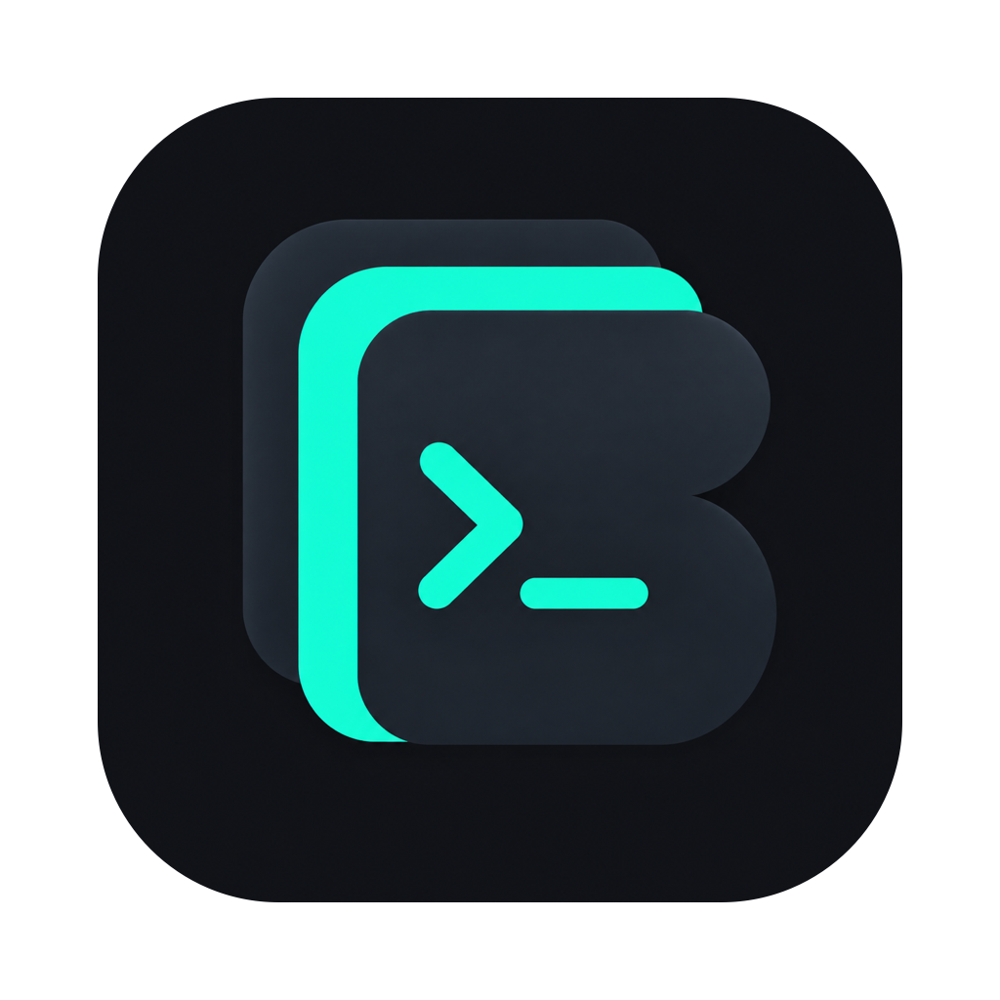
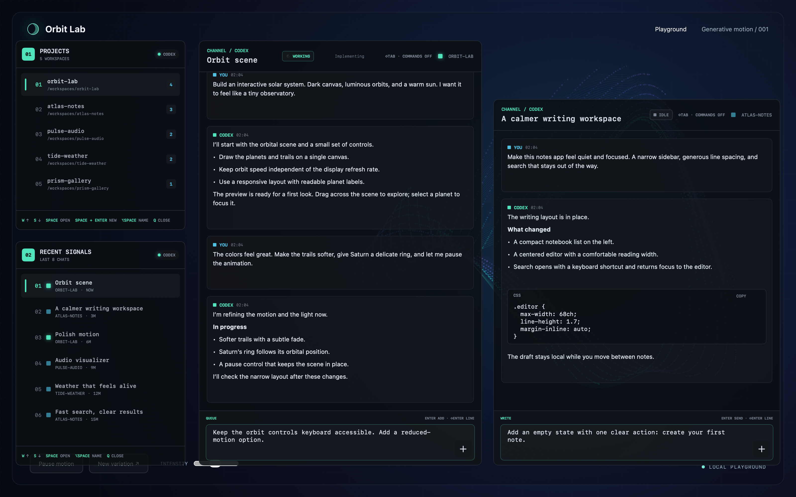
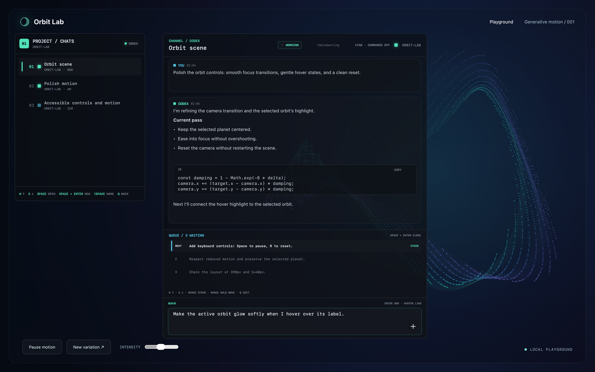
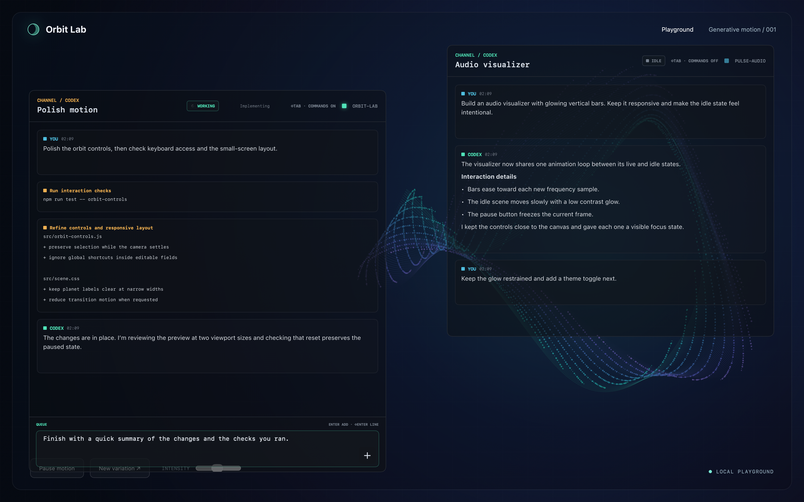
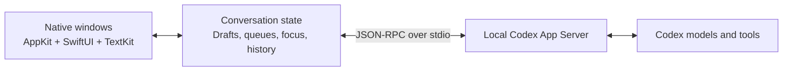

<p align="center">
  
</p>

<h1 align="center">Bavbav</h1>

<p align="center">
  <strong>A native macOS workspace for Codex.</strong><br />
  Keep your projects, conversations, and next steps in view.
</p>

<p align="center">
  macOS 13+ &nbsp;·&nbsp; SwiftUI + AppKit &nbsp;·&nbsp; Keyboard-first
</p>

<p align="center">
  <a href="#get-started">Get started</a> &nbsp;·&nbsp;
  <a href="#keyboard-cheat-sheet">Keyboard shortcuts</a> &nbsp;·&nbsp;
  <a href="#under-the-hood">Architecture</a> &nbsp;·&nbsp;
  <a href="https://github.com/denizybd/bavbav/issues">Report an issue</a>
</p>

Bavbav brings Codex conversations into compact, independent macOS windows. Keep a live preview in sight, work across several projects, and line up your next instructions while an agent is still running. Move between them with the keyboard, with each conversation keeping its own draft and queue.

Built in Swift with AppKit and SwiftUI, Bavbav connects to your installed Codex App Server over local stdio. It uses your existing Codex setup for models, authentication, and coding tools.



<sub>All three screenshots use Bavbav's actual native interface with fictional projects and English demo conversations.</sub>

## Why Bavbav

- **Keep several conversations open.** Arrange project chats beside one another. Switch focus without replacing the whole workspace, and return to an open conversation with its reading position intact.
- **Give the next instruction when it occurs to you.** Queue follow-ups for the same conversation, reorder them, or send a selected instruction into the running turn.
- **Close a window while work continues.** Press `Q` outside text editing to dismiss a chat. Bavbav releases its view while the active Codex turn keeps running; the menu bar shows the number of running chats.
- **Make room for the work underneath.** Adjust background transparency while text, controls, and focus outlines stay opaque. Resize panels from their corners and keep the dimensions you prefer.

## Queue, reorder, steer

Sending a message while the same conversation is working adds it to that conversation's queue. A different conversation can start its own turn immediately.

Open the queue to change the order, bring an instruction back into the composer, or **steer** the active turn with a selected message. Normal and Plan modes apply to new turns; changing modes does not rewrite the mode of a turn already in progress.



## Keep the preview in sight

Background transparency runs from fully opaque to fully transparent. Message surfaces and code blocks follow the same setting, while the foreground remains readable. A thin green outline identifies the focused window.

The windows behave like regular macOS windows: bring them forward with shortcuts, arrange them around your editor or preview, and use `⌘Tab` to move between apps.



## Inside the workspace

| Feature | What you can do |
| --- | --- |
| **Projects and recents** | Reopen Codex conversations, create project folders and chats, rename entries, and keep a preferred order. |
| **Rich messages** | Read Markdown, tables, code blocks, mathematical notation, and images in native views. Select message text and copy code directly. |
| **Visible tool activity** | Toggle commands, file changes, and tool output with `⇧Tab`, independently for each conversation. |
| **Attachments** | Drop images or documents into a chat, or choose files from the composer. Preview and remove them before sending. |
| **Normal, Plan, and Goal** | Choose how the next turn should work, and manage a conversation goal when the installed server supports it. |
| **Models and effort** | Choose from the connected account's model catalog, adjust reasoning effort, or inherit the conversation's settings. |
| **Standalone chat** | Start a Codex-powered conversation outside your project folders. |
| **Journal** | Turn new conversations into short, editable notes about events, decisions, and plans, with links back to their sources. |
| **Custom shortcuts** | Rebind actions by context, search bindings, and tune hold durations. On-screen hints follow your choices. |

Attachments are limited to **12 files per message, 25 MiB per file**. Images are passed to Codex as local image inputs; documents are passed as local file references for its tools to read. Dropping a file adds it to the draft without sending it.

## Get started

### Requirements

- **macOS 13 or later.** A Swift 6 toolchain and macOS SDK are required to build; check your installation with `swift --version`.
- **Codex installed and signed in.** Follow the [official Codex CLI setup](https://learn.chatgpt.com/docs/codex/cli) and [authentication guide](https://learn.chatgpt.com/docs/auth). Bavbav uses the installed executable and its existing authentication.
- **Git and internet access** to clone the repository and resolve Swift dependencies. Codex model requests also require a connection.

> **Execution defaults:** Bavbav currently starts and resumes coding turns with full filesystem/network access and `approvalPolicy: never`. Commands can run and files can change without an approval card. Use it with workspaces and instructions you trust. macOS privacy permissions still apply.

### Build and launch

Confirm your Codex CLI is available and authenticated:

```sh
codex --version
codex login status
```

If needed, run `codex login` and complete the sign-in flow. Then build Bavbav:

```sh
git clone https://github.com/denizybd/bavbav.git
cd bavbav
zsh scripts/build-app.sh
```

The build produces `dist/Bavbav.app`, packages its resources, and runs the native and fixture checks. Launch it from the same terminal so it uses the Codex executable on your shell's path:

```sh
BAVBAV_CODEX_BIN="$(command -v codex)" ./dist/Bavbav.app/Contents/MacOS/Bavbav
```

<details>
<summary>Launching from Finder or using another Codex installation</summary>

Without an override, Bavbav looks for an executable in this order:

1. `/Applications/ChatGPT.app/Contents/Resources/codex`
2. `/opt/homebrew/bin/codex`
3. `/usr/local/bin/codex`

If your installation is in one of those locations, you can launch normally:

```sh
open dist/Bavbav.app
```

For another location, supply an absolute path when launching the executable:

```sh
BAVBAV_CODEX_BIN="/absolute/path/to/codex" ./dist/Bavbav.app/Contents/MacOS/Bavbav
```

`BAVBAV_CODEX_BIN` takes priority over the automatic locations. Bavbav does not otherwise search the shell's `PATH`, and Finder launches do not inherit terminal-only environment variables. Authenticate using the same Codex installation you select here.

</details>

### Your first conversation

1. Press **`⌘1`** to open Projects. Bavbav combines Codex's saved local projects with the working directories of existing conversations.
2. Use **`W` / `S`** or the arrow keys to select a project, then **`Space`** to open it. Select a conversation and press **`Space`** again.
3. Press **`Enter`** to write. Send an instruction, keep the chat open, and open another conversation alongside it.
4. Use **`⌘4`** for the active conversation's model and effort, or **`⌘X`** for appearance and shortcut settings.

To create a project or a named chat, use `Space` + `Enter` in the relevant Projects list. New project folders are created beside the selected project, or under `~/Documents/ChatGPT` when no projects exist. You can also use `⌘3` for a standalone conversation.

## Keyboard cheat sheet

These are the defaults. Most navigation keys apply outside text editing; `Q`, `W`, `A`, `S`, and `D` remain ordinary letters while you type. The five panel shortcuts, `⌘1`–`⌘5`, are global and bring their panels forward without toggling them closed.

For `Space` + `Enter`, press Enter while holding Space, before the long press enters reorder mode.

| Keys | Action |
| --- | --- |
| `⌘1` / `⌘2` | Projects / recent Codex conversations |
| `⌘3` | Standalone chat launcher |
| `⌘4` / `⌘5` | Active conversation's model settings / journal |
| `W` / `S` or `↑` / `↓` | Move through a list |
| `Space` | Open the selected entry; steer a selected queue item |
| `⌥Space` | Rename the selected project or conversation |
| Hold `Space`, then `W` / `S` | Reorder an entry or queued message |
| `Space` + `Enter` | Create a project/chat in Projects; toggle the queue in a conversation |
| `⇧W` / `⇧A` / `⇧S` / `⇧D` | Focus the window above / left / below / right |
| `Enter` | Open the composer; send while writing; close an empty composer |
| `⇧Enter` / `⌘.` | Insert a newline / leave text editing |
| `⌘K` / `⌘O` | Open composer tools / choose an attachment while writing |
| `⇧Tab` | Show or hide command and tool activity |
| `B` / `End` | Jump to the latest message |
| `Q` | Go back or close the active panel; return a selected queue item to the composer |
| `⌘X` | Open app settings, including while writing |
| `⌘H` / `⌘Q` | Hide Bavbav / quit it completely |

Click a message and use `⌘A` / `⌘C` to select and copy its text. Inside Bavbav, the default `⌘X` opens settings instead of cutting text; you can change this binding in **Settings → Shortcuts**.

## Execution and local data

Bavbav's interface runs locally. Conversations and model requests go through your installed Codex runtime and its configured services; local rendering does not mean offline inference.

- **Drafts and attachments:** Drafts persist locally. Imported files are copied into `~/Library/Application Support/Bavbav/Attachments/`; original files are left in place. The pending message queue is held in memory and is not guaranteed to recover after a full quit.
- **Images and links:** Local and embedded images can render in messages. Remote HTTPS image previews require an explicit load action. Raw HTML is not executed; local file links reveal files in Finder.
- **Journal:** Automatic note extraction is enabled by default and uses additional Codex requests, capped at 60 per day. Press `P` in the journal to pause it. It processes new conversation activity rather than automatically scanning your entire history. Notes are stored under `~/Library/Application Support/Bavbav/Journal/`, retain source references, and can be edited or deleted. These local files are not separately encrypted.
- **Closing and quitting:** `Q` closes a view while Bavbav and its active work remain running. `⌘Q` exits the app; continued background work is not promised after quitting or shutting down the Mac.

## Under the hood



| Location | Responsibility |
| --- | --- |
| [`Sources/Bavbav`](Sources/Bavbav) | Window coordination, keyboard routing, native transcripts, composer, appearance, and journal UI. |
| [`Sources/BavbavCore`](Sources/BavbavCore) | App Server transport, project discovery, conversation models, message reconciliation, and journal rules. |
| [`Tests/BavbavChecks`](Tests/BavbavChecks) | Core behavior checks and optional protocol/integration checks. |
| [`Tests/BavbavFakeCodex`](Tests/BavbavFakeCodex) | A local server fixture for repeatable protocol and UI checks. |
| [`scripts`](scripts) | Icon preparation, release builds, resource packaging, and app validation. |
| [`Vendor/SwiftMath`](Vendor/SwiftMath) | Native mathematical typesetting, with a small resource lookup patch for packaged macOS apps. |

The UI keeps runtime state per conversation, reconciles optimistic sends with server events, and protects current content from stale history responses. Closing a detail window releases its view without clearing the running turn or its queue. Rich-text, formula, and image caches have explicit size limits.

The transport follows the [Codex App Server protocol](https://learn.chatgpt.com/docs/app-server). Markdown uses the pinned `swift-markdown` dependency; mathematical notation is rendered with the vendored SwiftMath package.

## Development and checks

For the complete packaged-app validation:

```sh
zsh scripts/build-app.sh
.build/release/BavbavChecks
codesign --verify --deep --strict dist/Bavbav.app
```

The build script exercises native rendering, image and link handling, attachments, composer actions, shortcuts, scrolling, window resizing, appearance, journal behavior, and standalone chats. Its fixture checks do not send prompts to your real Codex account.

For core changes and explicit protocol checks without packaging:

```sh
swift build
swift run BavbavChecks
BAVBAV_CODEX_BIN="$PWD/.build/debug/BavbavFakeCodex" .build/debug/BavbavChecks --protocol-fixture
```

Live account checks are separate and opt-in: `swift run BavbavChecks --integration` reads account and history metadata; adding `--integration-turn` sends a real ephemeral test turn and consumes model usage. Native fixture checks do not establish real-account compatibility or replace testing an interaction in the running app.

## Current scope

Bavbav is an independently developed macOS client in active development.

- **Source build:** The packaging script uses ad-hoc signing for local builds. It does not produce a Developer ID signed, notarized distribution.
- **Language:** This README is English. Some controls and messages in the app still use Turkish.
- **Codex compatibility:** Available models and capabilities depend on your account and installed App Server version. Goal support is checked against the server.
- **Standalone CHAT:** The current UI labels this channel `ChatGPT`, but its conversations use Codex App Server. It does not synchronize your chatgpt.com history.
- **Concurrent writers:** If another client owns a conversation and it cannot be resumed for writing, Bavbav can fork it and continue in the new branch, leaving the original conversation intact.
- **Journal scope:** The journal is local to Bavbav; it does not sync with Apple Calendar or Google Calendar. Automatically extracted notes may need correction.

## Feedback and contributions

[Open an issue](https://github.com/denizybd/bavbav/issues) with the behavior you expected, what happened, and the shortest steps that reproduce it. Include your macOS version, Bavbav commit, and Codex version. Screenshots with fictional projects are especially useful for layout and interaction reports.

Focused pull requests are welcome. Explain the user-visible change and the checks you ran; for keyboard or window behavior, include what you verified in the running app. Keep credentials, private conversations, and personal project content out of reports and fixtures.

The repository does not yet include a project-wide license. Third-party code and fonts retain their own licenses; the app build bundles the dependency notices.

---

Created by [denizybd](https://github.com/denizybd). Bavbav is an independent project and is not affiliated with or endorsed by OpenAI.
